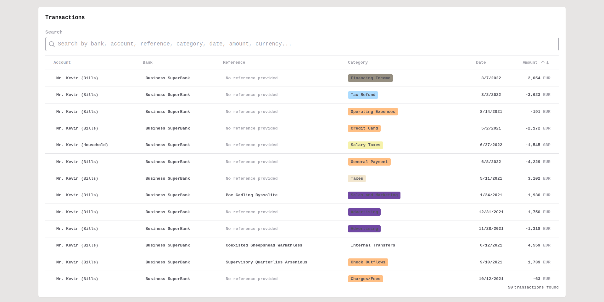
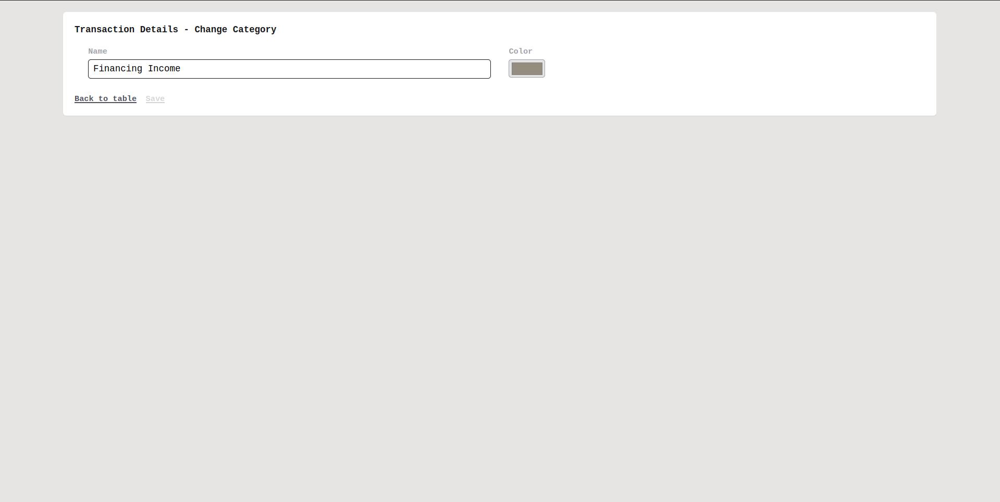

# Friday-challenge

<p align="center">
  
  
  <a href="https://www.linkedin.com/in/k-schaeffer/">
    
  </a>
</p>

<!--Status session-->
<h4 align="center"> 
	MVP Completed ✔️ / Improvements in progress  🚧
</h4>

<!-- Index session-->
<p align="center">
 <a href="#-overview">Overview</a> • 
 <a href="#%EF%B8%8F-functionalities">Functionalities</a> • 
 <a href="#-layout">Layout</a> • 
 <a href="#-local-setup">Local Setup</a> • 
 <a href="#-technologies">Technologies</a>
</p>

<!-- Overview session-->

## 👀 Overview

This monorepo contains a CRUD fullstack aplication developed in response to the Friday Finance full stack challenge. Even though I applied especially as a front end I thought that would be great to do the server side as well.

---

<!--Functionalities session-->

## ⚙️ Functionalities

- [x] Main page MVP
  - [x] There is a table of transactions
  - [x] There is an input that allows to search for transactions with any value present in the table
- [x] Details page MVP

  - [x] There is an input that allows to update the category of the chosen transaction
  - [x] There is an input that allows to create a new category and asign it to the chosen transaction

- [x] Main page Extras
  - [x] The table has an infinite scroll (initially loads 50 transactions and then 50 more at a time)
  - [x] The table head "amount" has ASC/DESC sort
- [x] Details page Extras

  - [x] The main input is an autocomplete which allows both to select an existing transaction or to create a new one
  - [x] There is a color input that allows to easily choose the color of the new category (when creating)

- [Extras in progress](https://github.com/K-Schaeffer/friday-challenge/issues)

---

<!--Layout session-->

## 🎨 Layout

<div align="center" style="display: flex; align-items: flex-start; justify-content: center; flex-direction: column;">
  Main
  
  Details
  
</div>

---

<!--Running session-->

## 🚀 Local Setup

### Requirements

- Node 18.x (LTS)
- Yarn 1.x (Classic)
- Docker Engine 23.x
- Docker Compose 2.x

#### 🎲 Running

If that's not the first time you're running, jump to <a href="####-quick-start">quick start</a>.

##### Clone this repository

```sh
git clone https://github.com/K-Schaeffer/friday-challenge.git
```

##### Go to clone directory

```sh
cd friday-challenge/
```

##### Copy local enviroment files

```sh
# Backend
cd packages/backend && cp .env.local .env
```

```sh
# Frontend
cd ../frontend && cp .env.local .env
```

```sh
# Go back to root directory
cd ../../
```

##### Install dependencies

```sh
yarn install
```

##### Start API

Follow these [instructions](https://github.com/K-Schaeffer/friday-challenge/tree/main/packages/backend#readme)

##### Start Application

```sh
yarn start:frontend
```

With those steps you'll have a containerized PostgreSQL container running, an API running on port **4000** and the front-end application running on port **3000**.

Open http://localhost:3000 and have fun :)

---

#### ⚡️ Quick start

##### Start API

Open a new terminal and run:

```sh
# friday-challenge/
yarn start:backend
```

##### Start Application

Open a new terminal and run:

```sh
# friday-challenge/
yarn start:frontend
```

Everything ready, go to http://localhost:3000/ and have fun.

---

<!--Bottom session-->
<h4 align=center>Made with ❤️ by Kauan Schaeffer 👋 <a href="https://www.linkedin.com/in/k-schaeffer/">Contact me :)</a></a></h4>
